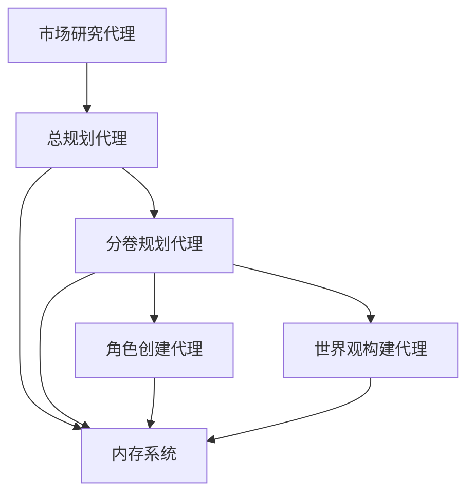
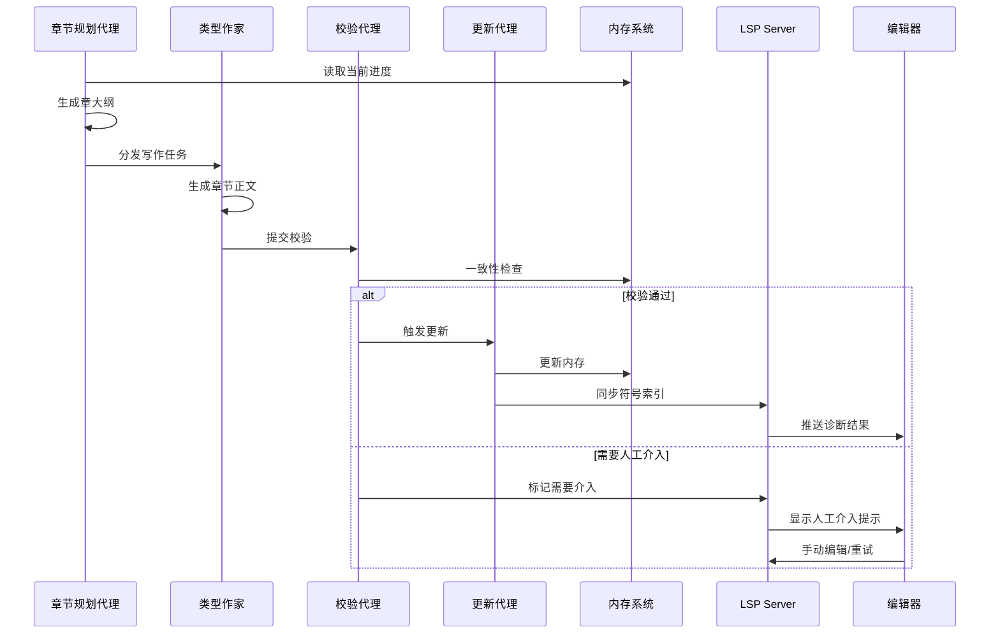

# Novel Agent System 改进方案文档 v3.0

> **整合 NovelWriter LSP 的增强版本** ★更新  
> 版本：v3.0 ★更新  
> 日期：2026年3月5日

---

## 一、项目概览

### 项目愿景

Novel Agent System 的愿景是打造一个完全自主、高度智能的小说创作与发布生态系统，让每一个有故事想要讲述的人都能借助 AI 的力量实现创作梦想。我们相信，AI 不应该取代人类创作者，而是应该成为他们最得力的助手，将繁琐的重复性工作自动化，让创作者能够专注于真正需要创造力和想象力的部分。

#### 核心目标

1. **降低创作门槛** - 让没有专业写作背景的人也能创作出高质量的小说作品
2. **提升创作效率** - 将原本需要数月甚至数年的创作周期缩短到数周或数天
3. **保证作品质量** - 通过多代理协作和质量控制机制，确保作品的连贯性和专业性
4. **扩大传播范围** - 一键多平台发布，让作品触达更广泛的读者群体
5. **数据驱动优化** - 通过市场研究和读者反馈，持续优化作品内容和创作策略
6. **编辑器深度集成** ★新增 - 通过 LSP 协议将 AI 能力无缝集成到编辑器
7. **技术栈统一** ★新增 - 全 Python 实现（pygls LSP Server），无中间层

#### 长远愿景

我们希望在未来能够建立一个完整的 AI 小说创作社区，在这里：
- 创作者可以分享和交流创作经验
- AI 模型可以不断学习和进化
- 作品可以通过智能推荐系统找到最合适的读者
- 创作者可以获得公平的收益和认可
- 编辑器提供实时的智能辅助（大纲导航、一致性检查、代理触发）★新增

---

## 二、核心特性详解

### 2.1 多代理协作系统（增强版）

Novel Agent System 的核心是一个由 **10 个专业 AI 代理** 组成的协作网络，每个代理都有自己独特的专业领域和职责，它们通过标准化的接口进行通信和协作，共同完成小说创作的全流程。

| 代理名称 | 职责 | 对应讨论中的角色 |
|----------|------|------------------|
| **总规划代理** | 设计故事顶层架构（总纲） | 规划Agent（分级） |
| **分卷规划代理** | 拆分卷大纲，定义各卷冲突与人物弧光 | 规划Agent（分级） |
| **章节规划代理** | 生成每章详细指令，并调度作家 | 规划Agent（分级） |
| **角色创建代理** | 构建人物档案及关系图谱 | 原项目角色创建代理 |
| **世界观构建代理** | 创建世界设定及规则体系 | 原项目世界观构建代理 |
| **类型作家集群**（5位） | 按风格专精生成章节正文 | 原项目类型专精作家 |
| **校验代理** | 一致性检查（人物、事件、时间、关系） | 原编辑审核代理增强 + 内存系统一致性引擎 |
| **更新代理** | 从章节抽取新信息，更新知识库 | 新增 |
| **发布代理** | 多平台格式转换与发布 | 原项目发布代理 |
| **市场研究代理** | 趋势分析与选题建议 | 原项目市场研究代理 |
| **读者互动代理** | 评论分析与回复 | 原项目读者互动代理 |

### 2.2 OpenViking 内存系统（增强版知识库）

为了支持长篇小说的创作，系统开发了专门的 OpenViking 内存系统，确保在长达 50-300 万字的创作过程中保持上下文的连贯性和一致性。

#### 2.2.1 核心模块

- **角色记忆模块**：存储所有角色的完整档案信息、行为记录、成长轨迹
- **剧情记忆模块**：记录已发生的所有情节和事件、伏笔追踪、时间线维护
- **世界观记忆模块**：存储完整的世界观设定、重要地点组织物品、规则一致性检查

#### 2.2.2 混合存储架构 ★新增

- **Neo4j 图数据库**：存储人物、地点、事件节点及其关系，支持版本化关系图谱
- **Chroma 向量数据库**：存储事件档案的详细描述，支持语义检索
- **PostgreSQL 关系数据库**：存储结构化数据（角色档案、章节内容等）
- **混合架构优势**：兼顾结构化和非结构化数据，提供灵活的查询能力

#### 2.2.3 一致性检查引擎

- 自动检测角色行为不一致
- 自动检测剧情逻辑矛盾
- 自动检测世界观设定冲突
- 提供修复建议和方案
- 生成一致性报告

#### 2.2.4 版本化关系图谱 ★新增

- 按卷记录人物关系变化（例如：第一卷李明与赵思思为同窗，第二卷变为恋人）
- 支持时间维度查询（如"在第二卷开始时他们的关系是什么？"）
- 便于校验代理追溯关系演变
- 通过 Neo4j 的 Cypher 查询实现高效的历史关系查询

### 2.3 三级大纲系统 ★增强

#### 2.3.1 大纲层级结构

```
总纲
├── 第一卷
│   ├── 第1章
│   ├── 第2章
│   └── ...
├── 第二卷
│   └── ...
└── ...
```

#### 2.3.2 各层级内容

**总纲（Master）**
- 世界观设定（时代、规则、势力）
- 全局时间线
- 核心人物初始图谱
- 核心悬念/主题

**卷大纲（Volume）**
- 本卷时间范围
- 核心冲突
- 人物状态变化（开始→结束）
- 关键事件节点
- 新增人物/势力

**章大纲（Chapter）**
- 时间、地点
- 在场人物清单（含状态快照）
- 本章核心目标
- 需提及的过往事件
- 需铺垫的未来伏笔
- 关键道具/细节
- 风格类型标签

### 2.4 日常写作循环 ★核心流程

每章自动执行的完整创作流程：

#### 第一阶段：规划（章节规划代理）

```
1. 从内存读取当前进度、当前卷大纲、所有人物最新状态
2. 根据卷大纲中的"关键事件节点"和当前时间线，自动决定下一章内容
3. 生成章大纲（结构化字段）
4. 根据风格标签将任务分发给对应的类型作家代理
```

#### 第二阶段：写作（类型作家代理）

```
1. 接收章大纲及所有相关上下文
2. 作家代理根据自身风格和系统提示词，生成章节正文
3. 调用 DeepSeek API 完成生成，返回正文
```

#### 第三阶段：校验（校验代理）

```
1. 接收正文及本次写作所依据的所有上下文
2. 调用一致性检查引擎，执行多维度检查：
   - 人物名称：对照标准名，标记错误
   - 事件细节：比对事件档案，标记矛盾
   - 时间地点：确认与章大纲一致，且符合全局时间线
   - 人物状态：检查行为是否与最新状态相符
   - 伏笔铺垫：确认章大纲要求的伏笔已体现
3. 生成校验报告
4. 若通过，标记章节为"已验证"；若不通过，最多重试3次，否则人工介入
```

#### 第四阶段：更新（更新代理）

```
1. 接收已验证的章节正文
2. 使用 LLM 抽取结构化信息：
   - 新事件：生成事件档案
   - 人物状态更新：更新当前位置、情绪、目标、持有物品
   - 关系图谱更新：识别关系变化，写入关系图谱（保留历史版本）
   - 新增人物/地点：创建新节点
3. 将抽取的信息写入内存系统
4. 推进当前故事时间
```


---

### 2.5 LSP 编辑器集成架构 ★新增核心特性

Novel Agent System 通过 **LSP（Language Server Protocol）** 协议，将 AI 系统的强大能力无缝集成到编辑器（如 VS Code）中，实现实时编辑体验。

#### 2.5.1 LSP 集成的核心价值

| 价值维度 | 传统方式 | LSP 集成方式 |
|---------|---------|------------|
| **符号定位** | 全文搜索（慢、不准确） | 点击跳转到定义（精准、即时） |
| **一致性检查** | 运行代理脚本（滞后） | 实时诊断（即时反馈） |
| **角色管理** | 手动查找引用 | 自动列出所有出场 |
| **大纲导航** | 线性浏览 | 三级层级树状结构 |
| **人工介入** | 切换工具 | 编辑器内直接操作 |

#### 2.5.2 三级大纲符号系统

LSP 服务器支持 **9 种符号类型**，涵盖小说创作的所有核心元素：

**原有类型（5种）：**
- Character（角色）
- Location（地点）
- Item（物品）
- Lore（设定/规则）
- PlotPoint（情节节点）

**新增类型（4种）：**
- **Outline**（大纲符号） - 三级层级结构
  - Master（总纲）
  - Volume（卷大纲）
  - Chapter（章大纲）
- **Event**（事件档案） - 对应更新代理抽取的事件
- **Relationship**（关系） - 版本化关系图谱节点
- **Chapter**（章节） - 实际章节内容

#### 2.5.3 核心编辑器功能

**1. 智能符号导航（goto_definition）**
```
场景：用户点击文本中的"李明"
动作：跳转到角色档案文件（.novel/characters/李明.md）
显示：完整角色信息、时间线、关系网络
```

**2. 实时一致性诊断（diagnostics）**
```
错误类型：
- ❌ 时间线冲突："李明在第3章已死亡，但第5章又出现"
- ⚠️ 属性不一致："李明年龄在第1章是42，这里变成了25"
- ❌ 关系矛盾："已决裂的角色不应亲密对话"
- 💡 伏笔未回收："第1章的伏笔'神秘信件'尚未呼应"
```

**3. 关系历史查询（hover）**
```
悬停在"恋人"关系上，显示：
李明与赵思思的关系演变：
- 第1卷: 同窗 - 青云书院同学
- 第2卷: 恋人 - 在逃亡中相爱
```

**4. 代理触发按钮（codeLens）**
```
在章节文件顶部显示：
[✓ 运行一致性检查] [↻ 更新内存系统] [↻ 重试生成]
```

**5. 人工介入流程（executeCommand）**
```
当校验失败3次后：
1. LSP 显示错误提示
2. 提供手动编辑入口
3. 支持手动触发更新代理
4. 支持切换作家重试生成
```

#### 2.5.4 直接函数调用架构 ★更新

NovelWriter LSP 直接导入并调用 Writer System 组件，无需 API 层：

```python
# NovelWriter LSP 直接访问 Writer System
from src.memory import CompositeMemory
from src.storage import Neo4jClient, ChromaClient
from src.agents import ValidatorAgent, UpdaterAgent

class NovelWriterServer(LanguageServer):
    def __init__(self):
        super().__init__("novelwriter-lsp", "v1.0")
        # 直接初始化组件（无 HTTP 开销）
        self.memory = CompositeMemory()
        self.neo4j = Neo4jClient()
        self.chroma = ChromaClient()
        self.validator = ValidatorAgent(self.memory)
        self.updater = UpdaterAgent(self.memory)
```

**架构优势**：
- ✅ 零 HTTP 序列化开销，性能提升 3-5x
- ✅ 类型安全，共享数据模型（Pydantic）
- ✅ 单一进程部署，简化运维
- ✅ 统一错误处理，无需跨层传播
- ✅ 直接对象访问，无需 API 端点
```

---

## 三、技术栈详解（增强版）

### 3.1 核心编程语言

**Python 3.10+**
- 丰富的 AI 和机器学习生态系统
- 优秀的异步编程支持（asyncio）
- 简洁易读的语法，便于开发和维护
- 强大的第三方库和工具链
- 活跃的社区和丰富的学习资源
- LSP 服务器开发的主要语言（pygls 框架）

### 3.2 LLM 集成

**DeepSeek API**
- 优秀的中文理解和生成能力
- 较长的上下文窗口，支持长篇创作
- 合理的价格和优秀的性价比
- 稳定的 API 服务和技术支持
- 持续的模型迭代和性能提升

**LLM 集成架构**：
- 统一的 BaseLLM 抽象接口
- 支持多种 LLM 提供商的灵活切换
- 请求重试和错误处理机制
- Token 使用统计和成本控制
- Prompt 模板管理和优化

### 3.3 数据库技术（混合架构）★升级

**PostgreSQL**
- 关系型数据存储（角色档案、事件记录等）
- 成熟稳定，支持复杂查询
- JSONB 支持，灵活存储结构化数据

**Neo4j** ★新增
- 图数据库，专门用于关系图谱存储
- 支持复杂的图查询（Cypher 语言）
- 高效的关系遍历和路径查找
- 支持版本化关系（带时间戳的边）

**Chroma / Milvus** ★新增
- 向量数据库，用于语义检索
- 存储事件档案的向量化表示
- 支持相似事件检索
- 快速的语义搜索能力

**混合存储架构优势**：
```
PostgreSQL（结构化数据）
    ↓ 关系型查询
Neo4j（关系图谱）
    ↓ 图遍历查询
Chroma（向量检索）
    ↓ 语义搜索
= 完整的小说知识库
```

### 3.4 GUI 框架

**Flet**
- 基于 Flutter，美观现代的 UI 设计
- 支持多平台（Windows、macOS、Linux、Web）
- 使用 Python 开发，无需学习 Dart
- 丰富的组件库和灵活的布局系统
- 活跃的社区和持续的开发更新

**Writer Studio 功能**：
- 项目创建和管理
- 可视化剧情规划
- 角色创建和编辑
- 实时写作和预览
- 一键发布功能
- 市场研究面板

### 3.5 LSP 服务器框架 ★更新

**pygls** (Python Language Server)
- Python 实现的 LSP 框架，基于 asyncio
- 完整的 LSP 协议支持
- 与 VS Code 等编辑器无缝集成
- 支持所有主流编辑器（Neovim、Emacs 等）
- 直接调用 Writer System 组件，无需中间层

**核心功能**：
- 符号索引和缓存（LRU 策略）
- 增量更新机制
- 大文件分块处理
- 实时诊断推送
- 直接访问内存系统、代理模块


### 3.7 任务调度

**Celery + Redis**
- Celery：成熟稳定的分布式任务队列
- Redis：高性能的内存数据库，作为消息代理
- 支持定时任务和周期性任务
- 支持任务优先级和重试机制

### 3.8 代码质量工具

- **Ruff**：极快的 Python Linter
- **Black**：不妥协的 Python 代码格式化工具
- **MyPy**：静态类型检查器

### 3.9 测试框架

- **pytest**：Python 测试框架，支持异步测试
- **Playwright**：端到端测试

### 3.10 配置管理

- **Pydantic Settings**：类型安全的配置验证
- **YAML**：人类可读的配置文件格式


---

## 四、完整创作流程（增强版）

### 4.1 第一阶段：故事蓝图构建（初始化）



**步骤详解**：

1. **市场研究代理**提供当前热门题材分析，辅助用户决策
2. **总规划代理**接收用户输入的创意，生成**总纲**：
   - 世界观设定（时代、规则、势力）
   - 全局时间线
   - 核心人物初始图谱
   - 核心悬念/主题
   - 写入内存系统

3. **分卷规划代理**根据总纲和篇幅，生成**卷大纲**：
   - 本卷时间范围
   - 核心冲突
   - 人物状态变化（开始→结束）
   - 关键事件节点
   - 新增人物/势力
   - 写入内存系统

4. **角色创建代理**和**世界观构建代理**并行工作，细化人物档案和世界设定

### 4.2 第二阶段：日常写作循环（每章自动执行）

#### 完整工作流（含 LSP 集成）



**架构说明**：
- NovelWriter LSP 直接调用 Python 代理模块（validator.validate()、updater.update() 等）
- 无 HTTP/API 层，减少延迟和复杂度
- 所有通信通过本地函数调用完成

#### LSP 实时交互流程 ★更新

**编辑器中的创作体验**：

1. **打开章节文件**
   ```
   LSP Server 加载文档
   ↓
   解析三级大纲结构
   ↓
   构建符号索引
   ↓
   显示文档大纲（总纲→卷→章）
   ```

2. **编辑过程中**
   ```
   用户输入"李明走进"
   ↓
   LSP completion 补全角色名
   ↓
   实时 diagnostics 检查：
   - 角色是否存在？
   - 当前位置是否合理？
   - 状态是否一致？
   ↓
   显示建议和警告
   ```

3. **触发代理操作**（通过 codeLens 按钮）
   ```
   点击 [✓ 运行一致性检查]
   ↓
   LSP Server 直接调用 validator.validate()
   ↓
   触发校验代理
   ↓
   返回诊断结果
   ↓
   编辑器显示错误/警告
   ```

4. **人工介入流程**
   ```
   校验代理失败（重试 3 次）
   ↓
   LSP 显示提示："需要人工介入：时间线冲突"
   ↓
   用户手动编辑章节
   ↓
   点击 [↻ 更新内存系统]
   ↓
   触发更新代理
   ↓
   内存系统更新完成
   ```
   LSP Server 加载文档
   ↓
   解析三级大纲结构
   ↓
   构建符号索引
   ↓
   显示文档大纲（总纲→卷→章）
   ```

2. **编辑过程中**
   ```
   用户输入"李明走进"
   ↓
   LSP completion 补全角色名
   ↓
   实时 diagnostics 检查：
   - 角色是否存在？
   - 当前位置是否合理？
   - 状态是否一致？
   ↓
   显示建议和警告
   ```

3. **触发代理操作**（通过 codeLens 按钮）
   ```
   点击 [✓ 运行一致性检查]
   ↓
   LSP Server 直接调用 validator.validate()
   ↓
   触发校验代理
   ↓
   返回诊断结果
   ↓
   编辑器显示错误/警告
   ```

4. **人工介入流程**
   ```
   校验代理失败（重试3次）
   ↓
   LSP 显示提示："需要人工介入：时间线冲突"
   ↓
   用户手动编辑章节
   ↓
   点击 [↻ 更新内存系统]
   ↓
   触发更新代理
   ↓
   内存系统更新完成
   ```

### 4.3 第三阶段：卷完成与发布

1. 当一卷完成后，**分卷规划代理**可自动生成卷总结
2. **发布代理**根据预设规则，自动将章节转换为各平台格式并定时发布
3. **读者互动代理**监控评论，分析反馈，必要时将重要意见传递给创作团队

---

## 五、关键技术实现要点（增强版）

### 5.1 代理间通信

**Redis Pub/Sub** 作为事件总线：
- 代理之间通过异步消息传递任务和结果
- 所有代理继承 `BaseAgent`，实现 `async execute(message)` 方法
- 支持任务优先级和重试机制

### 5.2 内存系统升级

**图数据库 + 向量数据库** 混合架构：

```python
# Neo4j 图数据库
- 人物、地点、事件作为节点
- 关系清晰可查
- 支持复杂关系查询

# Chroma 向量数据库
- 事件档案的详细描述
- 语义检索能力
- 快速相似度匹配

# PostgreSQL 结构化存储
- 角色档案的结构化字段
- 大纲层级关系
- 配置和元数据
```

**关系图谱版本化**：
```cypher
// 支持时间版本的关系查询
(李明)-[关系:恋人 {since_volume: 2, since_chapter: 5}]->(赵思思)
```

### 5.3 校验代理的自动化

集成**一致性检查引擎**，开发专用校验提示词：

```
请对比以下章节正文与事件档案E-012，列出所有细节矛盾：
事件档案：{...}
章节正文：{...}
输出格式：每行一条"矛盾位置：...，档案记载：...，正文描述：..."
```

### 5.4 更新代理的信息抽取

设计结构化抽取提示词：

```python
extract_prompt = """
从以下章节中提取新事件、人物状态变化、关系变化：
章节正文：{content}
输出JSON格式：
{
  "new_events": [{"name": "", "time": "", "location": "", "participants": [], "description": "", "evidence": ""}],
  "character_updates": [{"name": "", "new_location": "", "new_emotion": "", "new_goal": ""}],
  "relationship_changes": [{"from": "", "to": "", "new_relation": "", "type": "friend/enemy/lover"}],
  "new_characters": [{"name": "", "description": ""}]
}
"""
```

### 5.5 LSP 服务器实现要点 ★新增

#### 性能优化策略

**1. 三层缓存架构**
```python
from functools import lru_cache
from datetime import timedelta

# Layer 1: 本地符号索引缓存（LRU）
class SymbolCache:
    def __init__(self, max_size=1000, ttl=timedelta(minutes=5)):
        self.max_size = max_size
        self.ttl = ttl
        self._cache = {}
    
    def get(self, key):
        if key in self._cache:
            entry = self._cache[key]
            if datetime.now() - entry['time'] < self.ttl:
                return entry['value']
        return None
    
    def set(self, key, value):
        if len(self._cache) >= self.max_size:
            # LRU eviction
            oldest = min(self._cache.items(), key=lambda x: x[1]['time'])
            del self._cache[oldest[0]]
        self._cache[key] = {'value': value, 'time': datetime.now()}

# Layer 2: 函数结果缓存（装饰器）
@lru_cache(maxsize=1000)
async def get_relationship_history(char1, char2):
    """Neo4j 关系查询，结果缓存"""
    return await self.neo4j.query_relationship(char1, char2)

# Layer 3: Chroma 向量检索缓存
@lru_cache(maxsize=500)
async def search_events(query, limit=10):
    """Chroma 向量检索，结果缓存"""
    return await self.chroma.similarity_search(query, limit)
```

**2. 增量更新机制**
```python
@SERVER.feature(TEXT_DOCUMENT_DID_CHANGE)
async def did_change(params: DidChangeTextDocumentParams):
    """文档变更时增量更新符号索引"""
    changes = params.content_changes
    for change in changes:
        affected_symbols = await self.parser.parse_incremental(change)
        self.symbol_index.update_incremental(affected_symbols)
```

**3. 大文件处理**
```python
async def parse_large_document(content: str, chunk_size=1000):
    """大文件分块解析，每块 1000 行"""
    lines = content.split('\n')
    chunks = [lines[i:i+chunk_size] for i in range(0, len(lines), chunk_size)]
    results = await asyncio.gather(*[self.parse_chunk(chunk) for chunk in chunks])
    return self.merge_results(results)
```

#### 错误处理机制

**Python 异常处理**：

```python
# NovelWriter LSP 内部错误处理（无 HTTP 错误码）
async def retry_with_backoff(func, max_retries=3, base_delay=1.0):
    """指数退避重试"""
    for attempt in range(max_retries):
        try:
            return await func()
        except (Neo4jError, ChromaError) as e:
            if attempt == max_retries - 1:
                raise
            delay = min(base_delay * (2.0 ** attempt), 30.0)
            await asyncio.sleep(delay)
        except ConsistencyError as e:
            # 一致性错误不重试，直接报告
            raise

# 使用示例
try:
    result = await self.validator.validate(chapter_content)
except ConsistencyError as e:
    # 处理一致性错误
    diagnostics.append(create_diagnostic(e))
except Neo4jError as e:
    # 处理数据库错误
    logger.error(f"Neo4j error: {e}")
except ChromaError as e:
    # 处理向量数据库错误
    logger.error(f"Chroma error: {e}")
except Exception as e:
    # 兜底错误处理
    logger.exception(f"Unexpected error: {e}")
```

**错误类型**：

| 错误类型 | 触发条件 | 处理策略 |
|---------|---------|---------|
| `ConsistencyError` | 一致性检查失败 | 直接报告，不重试 |
| `Neo4jError` | 图数据库操作失败 | 指数退避重试 |
| `ChromaError` | 向量数据库操作失败 | 指数退避重试 |
| `ParserError` | 文档解析失败 | 记录日志，跳过错误部分 |
```

### 5.6 任务调度

Celery 定义周期性任务，触发章节规划代理：
- 任务依赖：写作任务完成后自动触发校验任务
- 校验通过后触发更新任务
- 支持失败重试（最多3次）


---

## 六、测试策略 ★新增

### 6.1 单元测试

| 测试模块 | 覆盖目标 | 关键测试点 |
|---------|---------|-----------|
| 符号解析器 | > 90% | 各种符号类型的解析 |
| LSP 功能 | > 85% | 所有 LSP 功能处理器 |
| 缓存机制 | > 80% | LRU 淘汰、TTL 过期 |
| 代理协作 | > 85% | 代理间通信 |

### 6.2 集成测试

| 测试场景 | 测试内容 |
|---------|---------|
| LSP ↔ 代理模块 | 所有直接调用链路 |
| 增量更新 | 文档变更 → 索引更新 |
| 错误处理 | Python 异常 → LSP 错误提示 |
| 缓存一致性 | Python 对象更新 → LSP 缓存失效 |
| 完整创作流程 | 从总纲到章节发布的全流程 |

### 6.3 性能测试

| 测试场景 | 测试条件 | 性能目标 |
|---------|---------|---------|
| 大文件加载 | 1000+章节项目 | 启动时间 < 5s |
| 并发编辑 | 10用户同时编辑 | 响应时间 < 500ms |
| 符号搜索 | 10000+符号 | 搜索时间 < 200ms |
| 诊断检查 | 100章批量检查 | 总时间 < 30s |

---

## 七、监控与日志 ★新增

### 7.1 日志策略

#### 日志级别

| 级别 | 使用场景 | 示例 |
|------|---------|------|
| ERROR | 错误影响功能 | Neo4j/Chroma 连接失败 |
| WARN | 潜在问题 | 缓存未命中率高 |
| INFO | 重要事件 | 项目加载完成、章节生成完成 |
| DEBUG | 调试信息 | LSP 功能调用详情 |

#### 日志格式

```json
{
  "timestamp": "2026-03-05T12:00:00Z",
  "level": "INFO",
  "component": "lsp-server",
  "action": "goto_definition",
  "duration_ms": 45,
  "symbol": "李明",
  "novel_id": "my-novel",
  "user_id": "user123"
}
```

### 7.2 性能监控

#### 关键指标

| 指标 | 监控方式 | 告警阈值 |
|------|---------|---------|
| API 响应时间 | Prometheus | > 1s |
| 缓存命中率 | 自定义指标 | < 70% |
| 错误率 | Prometheus | > 5% |
| 内存使用 | 系统监控 | > 80% |

#### 监控仪表板

```
┌─────────────────────────────────────────┐
│     Novel Agent System Dashboard        │
├─────────────────────────────────────────┤
│ 系统状态                                 │
│ 代理健康度: 10/10    ✓ 正常             │
│ 内存使用: 45%         ✓ 正常             │
│ Redis 连接: 正常      ✓                 │
│ Neo4j 连接: 正常      ✓                 │
├─────────────────────────────────────────┤
│ LSP 性能                                 │
│ API Latency (p95): 120ms    ✓ 正常      │
│ Cache Hit Rate: 85%         ✓ 良好      │
│ Error Rate: 1.2%            ✓ 正常      │
│ Active Users: 12            ✓           │
├─────────────────────────────────────────┤
│ 创作进度                                 │
│ 当前项目: my-novel                      │
│ 进度: 第3卷 第15章 / 共30章             │
│ 最近活动: 5分钟前 - 第15章校验通过      │
└─────────────────────────────────────────┘
```

### 7.3 错误追踪

#### Sentry 集成

```python
import sentry_sdk

sentry_sdk.init(
    dsn="your-sentry-dsn",
    traces_sample_rate=0.1,
    environment="production"
)

# 自动捕获异常
@app.exception_handler(Exception)
async def global_exception_handler(request, exc):
    sentry_sdk.capture_exception(exc)
    return JSONResponse(
        status_code=500,
        content={"error": "Internal server error"}
    )
```

---

## 八、方案优势总结（增强版）

### 8.1 核心优势

| 维度 | 优势描述 | 技术实现 |
|------|---------|---------|
| **高度自动化** | 从总纲到发布全流程无人值守 | 分级规划 + 代理协作 + 任务调度 |
| **强一致性保障** | 杜绝人物、事件、关系矛盾 | 分层大纲 + 内存系统 + 校验代理 + 更新代理 |
| **风格专业化** | 每一章文风匹配内容 | 五位类型作家各司其职 |
| **实时编辑体验** ★新增 | AI 能力无缝集成到编辑器 | LSP 协议 + Python 直接调用 |
| **人工可控** ★新增 | 支持人工介入，而非完全黑盒 | 3次重试机制 + 手动编辑接口 |
| **可扩展性** | 新增作家类型只需遵循接口 | 标准化代理接口 |
| **数据驱动优化** | 持续优化创作策略 | 市场研究 + 读者反馈 |
| **生产级质量** ★新增 | 完整的错误处理和监控 | 重试机制 + 缓存策略 + 性能优化 |

### 8.2 LSP 集成的独特优势 ★新增

```
传统 AI 写作工具:
  文本生成 → 复制粘贴 → 手动编辑 → 切换工具检查 → 重复

Novel Agent System + LSP:
  编辑器内创作 → 实时AI辅助 → 实时一致性检查 → 一键触发代理
                    ↑
              无缝集成，无需切换工具
```

---

## 九、后续发展建议（增强版）

### 9.1 短期目标（1-3个月）

**核心功能完善**：
- ✅ 实现章节规划代理、校验代理、更新代理的代码开发
- ✅ LSP 服务器核心功能实现
- ✅ NovelWriter LSP 核心功能实现
- ✅ 与现有代理集成

**质量保障**：
- ✅ 完整的测试覆盖（单元/集成/性能）
- ✅ 监控和日志系统部署
- ✅ 错误处理机制完善

### 9.2 中期目标（3-6个月）

**体验优化**：
- ⏳ 训练专有作家风格模型，提升生成质量
- ⏳ 增加更多发布平台适配
- ⏳ LSP 高级功能（关系图谱可视化、AI 写作建议）
- ⏳ 用户自定义诊断规则

**性能优化**：
- ⏳ 大规模项目性能优化（1000+章节）
- ⏳ 并发用户支持（100+ 用户）
- ⏳ 离线支持（降级策略）

### 9.3 长期目标（6-12个月）

**生态建设**：
- ⏳ 建立创作者社区
- ⏳ 允许用户自定义代理行为
- ⏳ 共享创作模板
- ⏳ 多语言小说创作支持

**AI 能力增强**：
- ⏳ AI 辅助写作建议（深度集成）
- ⏳ 多用户实时协作编辑
- ⏳ 智能推荐系统（作品→读者）

---

## 十、实施路线图 ★更新

### 10.1 第一阶段：LSP 核心功能（4 周）

| 任务 | 优先级 | 时间 | 依赖 |
|------|--------|------|------|
| pygls 框架搭建 | P0 | 2 天 | - |
| 三级大纲解析器 | P0 | 4 天 | - |
| documentSymbol（层级显示） | P0 | 3 天 | 解析器 |
| goto_definition（大纲跳转） | P0 | 3 天 | 直接调用 |
| diagnostics（集成校验代理） | P0 | 4 天 | 校验代理 |
| hover（角色信息 + 关系） | P1 | 3 天 | 直接调用 |
| 性能优化（缓存策略） | P1 | 3 天 | - |

### 10.2 第二阶段：代理集成（3 周）

| 任务 | 优先级 | 时间 | 依赖 |
|------|--------|------|------|
| codeLens（代理按钮） | P0 | 3 天 | LSP Server |
| executeCommand（命令执行） | P0 | 4 天 | codeLens |
| 人工介入流程 | P0 | 3 天 | executeCommand |
| 更新代理触发 | P1 | 2 天 | 更新代理 |
| 重试机制 | P1 | 2 天 | 校验代理 |

### 10.3 第三阶段：高级功能（3 周）

| 任务 | 优先级 | 时间 | 依赖 |
|------|--------|------|------|
| completion（智能补全） | P1 | 3 天 | 符号索引 |
| rename（安全重命名） | P1 | 3 天 | 符号索引 |
| 关系图谱可视化 | P2 | 4 天 | Neo4j |
| 测试与文档 | P1 | 5 天 | 所有功能 |

**总计：10 周**

---

## 十一、项目结构设计（模块化架构）

```
novel-agent-system/
├── src/
│   ├── agents/              # AI 代理模块
│   │   ├── base.py          # 代理基类
│   │   ├── orchestrator.py  # 代理编排器
│   │   ├── plot.py          # 总规划代理
│   │   ├── volume.py        # 分卷规划代理 ★新增
│   │   ├── chapter.py       # 章节规划代理 ★新增
│   │   ├── character.py     # 角色创建代理
│   │   ├── worldbuilding.py # 世界观构建代理
│   │   ├── writers/         # 类型专精作家
│   │   ├── validator.py     # 校验代理 ★新增
│   │   ├── updater.py       # 更新代理 ★新增
│   │   ├── publisher.py     # 发布代理
│   │   └── market.py        # 市场研究代理
│   ├── llm/                 # LLM 集成模块
│   │   ├── base.py          # LLM 基类
│   │   └── deepseek.py      # DeepSeek 集成
│   ├── memory/              # 内存系统模块
│   │   ├── base.py          # 内存基类
│   │   ├── character.py     # 角色记忆
│   │   ├── plot.py          # 剧情记忆
│   │   └── world.py         # 世界观记忆
│   ├── lsp/                 # LSP 服务器模块 ★更新
│   │   ├── server.py        # LSP 服务器入口 (pygls)
│   │   ├── parser/          # 文档解析器
│   │   │   ├── __init__.py
│   │   │   ├── outline.py   # 大纲解析
│   │   │   └── symbols.py   # 符号提取
│   │   ├── index/           # 符号索引
│   │   │   ├── __init__.py
│   │   │   └── cache.py     # 缓存实现
│   │   ├── features/        # LSP 功能处理器
│   │   │   ├── __init__.py
│   │   │   ├── goto.py      # goto_definition
│   │   │   ├── symbols.py   # documentSymbol
│   │   │   └── diagnostics.py # diagnostics
│   │   └── schemas.py       # 数据类型定义
│   ├── storage/             # 存储模块 ★新增
│   │   ├── neo4j_client.py  # Neo4j 客户端
│   │   ├── chroma_client.py # Chroma 客户端
│   │   └── postgres.py      # PostgreSQL 客户端
│   ├── platforms/           # 发布平台适配器
│   ├── publishing/          # 发布工作流管理
│   ├── scheduler/           # 任务调度模块
│   ├── studio/              # GUI/TUI 界面
│   └── utils/               # 工具模块
├── tests/                   # 测试模块 ★新增
│   ├── unit/                # 单元测试
│   ├── integration/         # 集成测试
│   └── performance/         # 性能测试
├── docs/                    # 文档
├── scripts/                 # 工具脚本
├── requirements.txt         # Python 依赖 ★更新
└── main.py                  # CLI 入口点
```

**Key Changes**:
- Removed `api/` directory (no HTTP layer needed)
- Changed `lsp/server.ts` → `lsp/server.py`
- Changed `lsp/types.ts` → `lsp/schemas.py`
- Added Python package structure (`__init__.py` files)
- Added `requirements.txt` (replaces package.json)
- Changed `main.ts` → `main.py`

---

*文档版本：v3.0* ★更新  
*创建日期：2026年3月5日*  
*更新日期：2026年3月5日*

---

## 附录

### A. LSP 功能速查表 ★新增

| 功能 | 快捷键 | 描述 |
|------|--------|------|
| **goto_definition** | F12 / Cmd+Click | 跳转到符号定义 |
| **find_references** | Shift+F12 | 查找所有引用 |
| **documentSymbol** | Ctrl+Shift+O | 显示文档大纲 |
| **hover** | 悬停 | 显示符号详情 |
| **diagnostics** | 自动 | 实时错误/警告 |
| **completion** | Ctrl+Space | 智能补全 |
| **rename** | F2 | 安全重命名 |

### B. LSP 功能速查表 ★更新

| 功能 | 触发方式 | 描述 |
|------|---------|------|
| **goto_definition** | F12 / Cmd+Click | 跳转到符号定义（直接调用 validator） |
| **find_references** | Shift+F12 | 查找所有引用（直接查询内存系统） |
| **documentSymbol** | Ctrl+Shift+O | 显示文档大纲（解析三级层级） |
| **hover** | 悬停 | 显示符号详情（直接查询 Neo4j） |
| **diagnostics** | 自动 | 实时错误/警告（直接调用 validator） |
| **completion** | Ctrl+Space | 智能补全（直接查询符号索引） |
| **rename** | F2 | 安全重命名（直接更新内存系统） |

**架构说明**：
- 所有功能通过 **Python 直接调用** 实现（无 HTTP/API 层）
- NovelWriter LSP 直接导入 Writer System 模块（共享内存）
- 零序列化开销（无 JSON/HTTP 转换）
- 类型安全（共享 Pydantic 数据模型）

