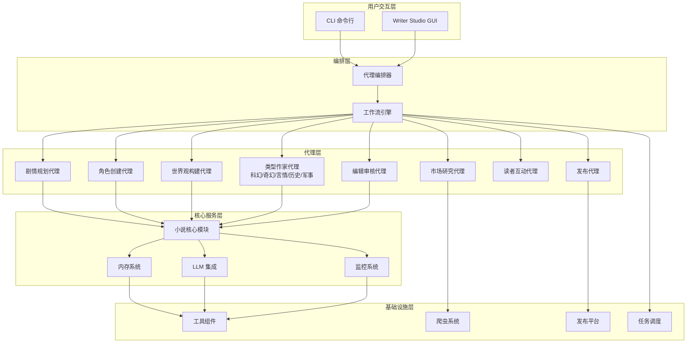

# 系统架构文档

## 目录

- [系统概述](#系统概述)
- [架构图](#架构图)
- [核心模块](#核心模块)
- [模块关系](#模块关系)
- [数据流](#数据流)
- [目录结构](#目录结构)

## 系统概述

Novel Agent System 是一个基于多代理协作的 AI 小说创作与发布平台，采用分层架构设计，通过专业化的 AI 代理完成从选题、创作到发布的全流程自动化。

## 架构图



## 核心模块

### 1. 用户交互层

#### CLI (`src/main.py`)
- **职责**：提供命令行接口
- **功能**：健康检查、单章生成、完整工作流、市场调研、启动 GUI

#### Writer Studio (`src/studio/`)
- **职责**：图形用户界面
- **功能**：项目管理、创作工具、发布控制、实时聊天界面
- **核心组件**：
  - `core/` - 状态管理和设置
  - `chat/` - 聊天界面和命令处理

### 2. 编排层

#### 代理编排器 (`src/agents/orchestrator.py`)
- **职责**：协调多个代理的工作流
- **功能**：任务分配、状态管理、结果聚合

#### 工作流引擎
- **职责**：管理端到端的小说创作流程
- **功能**：步骤编排、错误处理、进度跟踪

### 3. 代理层

#### 剧情规划代理
- **职责**：设计故事弧线和章节大纲
- **输出**：完整的剧情结构、章节概要

#### 角色创建代理
- **职责**：构建主角和配角档案
- **输出**：角色档案、关系图谱

#### 世界观构建代理
- **职责**：创建完整的世界设定和规则
- **输出**：世界设定文档、规则手册

#### 类型作家代理 (`src/agents/writers/`)
- **职责**：各类型小说创作
- **类型**：科幻、奇幻、言情、历史、军事
- **输出**：章节内容

#### 编辑审核代理
- **职责**：质量控制和修改建议
- **功能**：一致性检查、语法纠错、风格优化

#### 市场研究代理
- **职责**：趋势分析和竞品调研
- **数据来源**：各平台公开数据

#### 读者互动代理
- **职责**：评论分析和自动回复
- **功能**：情感分析、智能回复

#### 发布代理
- **职责**：多平台一键发布
- **平台**：Wattpad、Royal Road、Amazon KDP

### 4. 核心服务层

#### 小说核心模块 (`src/novel/`)
- **职责**：小说创作的核心逻辑
- **核心组件**：
  - `chapter_generator.py` - 章节生成器
  - `outline_generator.py` - 大纲生成器
  - `continuity.py` - 一致性检查
  - `character_profile.py` - 角色档案管理
  - `knowledge_graph.py` - 知识图谱
  - `timeline_manager.py` - 时间线管理
  - `validation_orchestrator.py` - 验证编排器

#### 内存系统 (`src/memory/`)
- **职责**：长期记忆和上下文管理
- **核心组件**：
  - `character_memory.py` - 角色记忆
  - `plot_memory.py` - 剧情记忆
  - `world_memory.py` - 世界观记忆
  - `composite_memory.py` - 复合记忆
  - `base.py` - 基础内存接口

#### LLM 集成 (`src/llm/`)
- **职责**：大语言模型接口封装
- **核心组件**：
  - `base.py` - 基础 LLM 接口
  - `model_router.py` - 模型路由
  - `rate_limited.py` - 速率限制
  - `prompts/` - 提示词模板

#### 监控系统 (`src/monitoring/`)
- **职责**：系统监控和健康检查
- **核心组件**：
  - `health.py` - 健康检查
  - `metrics.py` - 指标收集
  - `tracing.py` - 链路追踪
  - `alerts.py` - 告警系统

### 5. 基础设施层

#### 发布平台 (`src/publishing/`)
- **职责**：多平台发布适配
- **核心组件**：
  - `base.py` - 基础发布器接口
  - `wattpad_publisher.py` - Wattpad 发布
  - `royalroad_publisher.py` - Royal Road 发布
  - `publisher_manager.py` - 发布管理器

#### 任务调度 (`src/scheduler/`)
- **职责**：定时任务和后台处理
- **技术**：Celery + Redis
- **核心组件**：
  - `tasks.py` - 任务定义

#### 爬虫系统 (`src/crawlers/`)
- **职责**：市场数据采集
- **功能**：平台趋势、竞品分析

#### 工具组件 (`src/utils/`)
- **职责**：通用工具函数
- **核心组件**：
  - `config.py` - 配置管理
  - `logger.py` - 日志工具
  - `cache.py` - 缓存工具
  - `batch.py` - 批处理工具
  - `token_budget.py` - Token 预算管理

## 模块关系

### 依赖层次

```
用户交互层
    ↓
编排层
    ↓
代理层
    ↓
核心服务层
    ↓
基础设施层
```

### 核心依赖关系

1. **编排器** 依赖 **所有代理**
2. **所有代理** 依赖 **NovelCore**
3. **NovelCore** 依赖 **Memory** 和 **LLM**
4. **Memory** 依赖 **Utils**
5. **LLM** 依赖 **Utils**
6. **发布代理** 依赖 **Publishing**
7. **市场研究代理** 依赖 **Crawlers**
8. **工作流引擎** 依赖 **Scheduler**

## 数据流

### 小说创作完整数据流

```
1. 用户请求
   ↓
2. CLI/Studio 接收请求
   ↓
3. 编排器解析任务
   ↓
4. 工作流引擎初始化
   ↓
5. 市场研究代理（可选）
   ├─→ 爬虫系统采集数据
   └─→ 返回市场分析
   ↓
6. 剧情规划代理
   ├─→ 读取记忆系统
   ├─→ 调用 LLM 生成大纲
   └─→ 存储到记忆系统
   ↓
7. 角色创建代理
   ├─→ 读取记忆系统
   ├─→ 调用 LLM 生成角色
   └─→ 存储到记忆系统
   ↓
8. 世界观构建代理
   ├─→ 读取记忆系统
   ├─→ 调用 LLM 生成设定
   └─→ 存储到记忆系统
   ↓
9. 类型作家代理（逐章节）
   ├─→ 读取记忆系统（剧情、角色、世界观）
   ├─→ 调用 LLM 生成章节
   ├─→ 一致性检查
   ├─→ 存储到记忆系统
   └─→ 生成章节摘要
   ↓
10. 编辑审核代理
    ├─→ 读取记忆系统
    ├─→ 质量检查
    ├─→ 语法纠错
    └─→ 返回修改建议
   ↓
11. 发布代理（可选）
    ├─→ 格式转换
    ├─→ 平台适配
    └─→ 发布到目标平台
   ↓
12. 返回结果给用户
```

### 记忆系统数据流

```
写入流程：
代理 → NovelCore → Memory系统 → 分类存储（角色/剧情/世界观）

读取流程：
代理 → NovelCore → Memory系统 → 检索相关记忆 → 上下文构建 → 返回
```

## 目录结构

```
src/
├── __init__.py
├── main.py                          # CLI 入口
├── cli_extensions.py                # CLI 扩展
│
├── agents/                          # AI 代理模块
│   ├── base.py                      # 基础代理类
│   ├── orchestrator.py              # 代理编排器
│   └── writers/                     # 类型作家代理
│       ├── scifi_writer.py
│       ├── fantasy_writer.py
│       ├── romance_writer.py
│       ├── history_writer.py
│       └── military_writer.py
│
├── novel/                           # 小说核心模块
│   ├── chapter_generator.py         # 章节生成器
│   ├── outline_generator.py         # 大纲生成器
│   ├── outline_manager.py           # 大纲管理器
│   ├── character_profile.py         # 角色档案
│   ├── continuity.py                # 一致性检查
│   ├── consistency_verifier.py      # 一致性验证
│   ├── knowledge_graph.py           # 知识图谱
│   ├── timeline_manager.py          # 时间线管理
│   ├── timeline_validator.py        # 时间线验证
│   ├── validation_orchestrator.py   # 验证编排器
│   ├── summary_manager.py           # 摘要管理器
│   ├── chapter_summarizer.py        # 章节摘要
│   ├── summaries.py                 # 摘要模块
│   ├── fact_database.py             # 事实数据库
│   ├── fact_injector.py             # 事实注入
│   ├── reference_validator.py       # 引用验证
│   ├── transition_checker.py        # 过渡检查
│   ├── hallucination_detector.py    # 幻觉检测
│   ├── auto_fixer.py                # 自动修复
│   ├── glossary.py                  # 术语表
│   ├── simple_glossary.py           # 简单术语表
│   ├── entity_extractor.py          # 实体提取
│   ├── relation_inference.py        # 关系推理
│   ├── pronoun_resolver.py          # 代词解析
│   ├── inventory_updater.py         # 库存更新
│   ├── checkpointing.py             # 检查点
│   ├── compression.py               # 压缩
│   ├── token_budget.py              # Token 预算
│   ├── performance_benchmark.py     # 性能基准
│   ├── validation_metrics.py        # 验证指标
│   ├── repair_history.py            # 修复历史
│   ├── manual_review_api.py         # 人工审核 API
│   ├── schemas.py                   # 数据模型
│   ├── structured_input.py          # 结构化输入
│   ├── hierarchical_state.py        # 分层状态
│   ├── constitution.py              # 创作宪章
│   ├── validators.py                # 验证器
│   ├── registry/                    # 注册中心
│   │   ├── __init__.py
│   │   └── story_registry.py
│   └── recovery/                    # 恢复模块
│       ├── __init__.py
│       ├── retry_handler.py
│       └── degradation.py
│
├── memory/                          # 内存系统
│   ├── base.py                      # 基础内存接口
│   ├── character_memory.py          # 角色记忆
│   ├── plot_memory.py               # 剧情记忆
│   ├── world_memory.py              # 世界观记忆
│   ├── composite_memory.py          # 复合记忆
│   ├── compression.py               # 压缩
│   ├── memsearch_adapter.py         # Memsearch 适配器
│   └── __init__.py
│
├── llm/                             # LLM 集成
│   ├── base.py                      # 基础 LLM 接口
│   ├── model_router.py              # 模型路由
│   ├── model_router_trinity.py      # Trinity 模型路由
│   ├── optimized_model_router.py    # 优化模型路由
│   ├── trinity_router_example.py    # Trinity 路由示例
│   ├── rate_limited.py              # 速率限制
│   ├── kimi.py                      # Kimi 集成
│   ├── trinity_config.py            # Trinity 配置
│   ├── laozhang_config.py           # 老张配置
│   ├── prompts/                     # 提示词模板
│   │   └── __init__.py
│   └── __init__.py
│
├── publishing/                      # 发布模块
│   ├── base.py                      # 基础发布器
│   ├── wattpad_publisher.py         # Wattpad 发布
│   ├── royalroad_publisher.py       # Royal Road 发布
│   ├── publisher_manager.py         # 发布管理器
│   └── __init__.py
│
├── platforms/                       # 平台适配器
│   └── (平台相关代码)
│
├── scheduler/                       # 任务调度
│   ├── tasks.py                     # 任务定义
│   └── __init__.py
│
├── crawlers/                        # 爬虫系统
│   └── (爬虫相关代码)
│
├── studio/                          # Writer Studio GUI
│   ├── __init__.py
│   ├── i18n.py                      # 国际化
│   ├── core/                        # 核心组件
│   │   ├── __init__.py
│   │   ├── state.py                 # 状态管理
│   │   └── settings.py              # 设置
│   └── chat/                        # 聊天界面
│       ├── __init__.py
│       ├── flet_app.py              # Flet 应用
│       ├── message.py               # 消息组件
│       ├── commands.py              # 命令处理
│       ├── agents.py                # 代理集成
│       ├── discussion_planner.py    # 讨论规划
│       ├── streaming_progress.py    # 流式进度
│       ├── creative_cache.py        # 创意缓存
│       └── cover_integration.py     # 封面集成
│
├── monitoring/                      # 监控系统
│   ├── __init__.py
│   ├── health.py                    # 健康检查
│   ├── metrics.py                   # 指标
│   ├── tracing.py                   # 链路追踪
│   ├── alerts.py                    # 告警
│   ├── error_tracking.py            # 错误追踪
│   └── exporters.py                 # 导出器
│
├── utils/                           # 工具组件
│   ├── __init__.py
│   ├── config.py                    # 配置管理
│   ├── logger.py                    # 日志工具
│   ├── cache.py                     # 缓存工具
│   ├── batch.py                     # 批处理
│   ├── token_budget.py              # Token 预算
│   ├── nlp.py                       # NLP 工具
│   └── performance.py               # 性能工具
│
├── db/                              # 数据库模块
├── deployment/                      # 部署模块
├── export/                          # 导出模块
└── learning/                        # 学习模块
```

## 设计原则

### 1. 代理模式
所有代理继承自 `BaseAgent`，实现统一的 `async execute()` 接口。

### 2. 异步优先
核心操作均采用 `async/await` 模式，提高并发性能。

### 3. 结果模式
所有操作返回 `AgentResult`，包含成功状态、数据和错误信息。

### 4. 内存抽象
内存系统通过统一接口提供长期记忆能力，支持多种存储后端。

### 5. 配置集中
使用 Pydantic Settings 进行统一配置管理。
